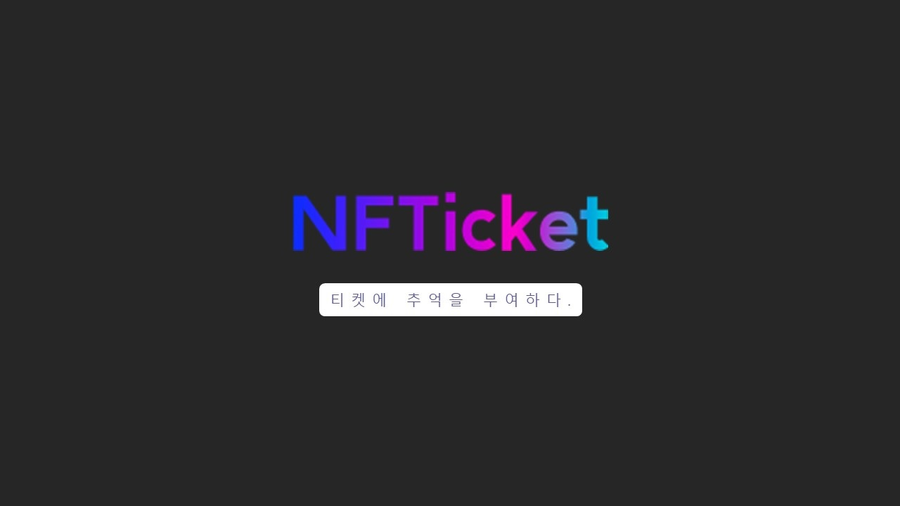
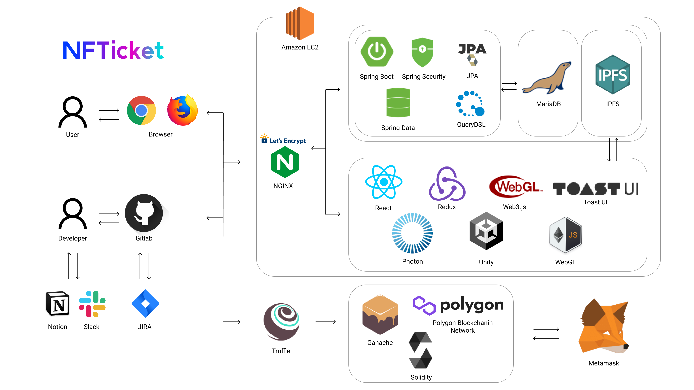
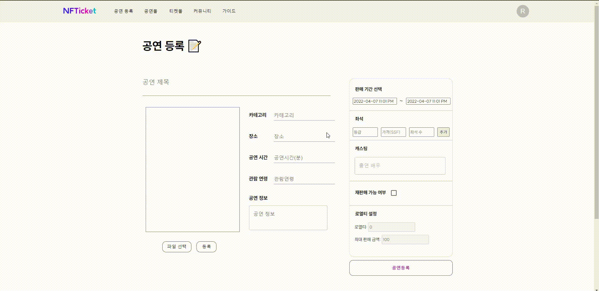
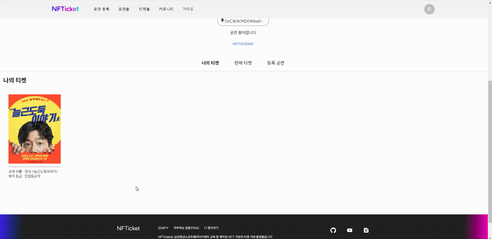

# 🎫 NFTicket - 티켓의 추억을 부여하다

## NFTicket 링크(PC 화면) : [https://nfticket.plus](https://nfticket.plus/)

## 소개 영상 보기 : [UCC 링크](https://youtu.be/lelttBR33Qo)

 

## ✔ 프로젝트 진행 기간

**_프로젝트 완수_** : 2022.02.21(월) ~ 2022.04.08(금) (46일간 진행)

**_프로젝트 고도화_** : 2022.06.13(월) ~ 2022.06.29(수) (13일간 진행)

AMAXG BIZA DAPpp 개발자 경진대회 1차 참여

 

## ✔ NFTicket - 배경

공연이 끝난 뒤, 누군가와의 혹은 그 순간 나만의 소중한 추억이 담긴 티켓이 사라지는 것이 아쉽지 않으셨나요? 모아두고 싶어도 아름답지 않아 결국 사라지는 추억들.

수집가처럼 앨범을 준비하고 일상을 기록하기는 힘들지만 마음만큼은, 그 순간의 추억을 간직하고 싶은 당신을 위해 준비했습니다.
 

## ✔ NFTicket - 개요

_- 당신의 추억의 조각을 기록하고 소유할 수 있도록 -_

**NFTicket**은 당신의 추억이 담긴 티켓을 기록하고 소유할 수 있는 NFT로 만들어 드리는 NFT 기반 블록체인 티켓 거래 시스템입니다.

블록체인 기술을 이용해 대체 불가능 한 나만의 티켓을 만들고, 추억을 담아, 소유할 수 있는 NFT 기반 티켓 예매 및 거래 서비스를 제공합니다.

나에게 특별한 가치가 있는 티켓, 나만의 개성을 담은 티켓을 만들어 다른 사람에게 뽐낼 수 있는 커뮤니티 기능을 제공합니다.

특별한 추억이 담긴 티켓을 거래함으로써 그 가치를 증명하고 인기 있는 티켓을 수집하고 소유 할 수 있습니다.
 

## ✔ 주요 기능

---

-   ### 공연 관리
    -   블록체인 기반의 안전한 공연 관리 시스템을 통해 당신의 공연을 등록해 보세요
    -   공연 기획이 부담스러운 인디 뮤지션들도 수수료 걱정 없이 공정하고 투명한 플랫폼에서 공연 정보와 일정을 관리할 수 있습니다.
    -   인기 있는 공연의 골칫거리 "암표", NFTicket에서 암표를 추적하고 리셀 정책을 설정하여 건전한 리셀 시장을 형성할 수 있습니다.
         
-   ### 공연 예매
    -   블록체인을 통해 공연을 예매하고, 당신의 티켓을 소장해보세요.
    -   스마트 컨트랙트를 통해 중개 시스템(Middle-man) 없이도 정당하게 나의 티켓을 예매할 수 있습니다.
    -   비대면 온라인 공연 등에도 블록체인 네트워크를 통해 티켓을 소유한 사람만 접속하도록 할 수 있습니다.
         
-   ### 티켓 꾸미기
    -   공연이 끝난 뒤에도 사라지지 않고 당신의 추억을 담은 메세지나 스티커를 붙여 나만의 티켓을 만들 수 있습니다.
         
-   ### 스마트 컨트랙트에서 거래
        - 이더리움 네트워크 내 스마트 컨트랙트를 통해 NFT 토큰(티켓) 거래
        - middle-man에 대한 의존성 제거
        - 이더리움 네트워크 내 참여 노드들에 의해 거래 검증
     

## ✔ 주요 기술

---

**Backend - Spring**

-   Visual Sttudio Code
-   Springboot 2.7.0
-   Spring JPA
-   Spring Security
-   Spring Validation
-   QueryDSL
-   MariaDB

**BlockChain - Ethereum**

-   Solidity 0.4.22 < 0.9.0
-   openzeppelin/contracts
-   Truffle

**Storage**

-   IPFS
-   IPFS-Cluster

**Frontend**

-   React
-   Redux
-   MUi
-   Toast UI Editor
-   Unity
-   Photon
-   WebGL
-   Web3.js

**Environment**

-   AWS EC2
-   NGINX
-   Docker

## ✔ 프로젝트 구조

---

## ✔ 협업 툴

---

-   Gitlab
-   Notion
-   Gather Town
-   JIRA
-   Slack
-   MatterMost
-   Webex
-   Code With Me
-   Visual Studio Live Share

## ✔ 협업 환경

---

-   Gitlab
    -   코드 버전 관리
    -   이슈 발행, 해결을 위한 토론
    -   MR시, 팀원이 코드리뷰를 진행하고 피드백 게시
-   JIRA
    -   매주 목표량을 설정하여 Sprint 진행
    -   업무의 할당량을 정하여 Story Point를 설정하고, In-Progress -> Done 순으로 작업
    -   소멸 차트를 통해 프로젝트 진행도 확인
-   회의
    -   Gether Town 아침회의 진행, 전날 목표 달성량과 당일 할 업무 브리핑
    -   각자 위치에서 건네야 할 말이 생기면 팀원의 위치로 이동하여 전달
    -   빠른 소통과 신속한 대응 가능
-   Notion
    -   회의가 있을때마다 회의록을 기록하여 보관
    -   회의가 길어지지 않도록 다음날 제시할 안건을 미리 기록
    -   기술확보 시, 다른 팀원들도 추후 따라할 수 있도록 보기 쉽게 작업 순서대로 정리
    -   컨벤션 정리
    -   간트차트 관리
    -   스토리보드, 스퀀스다이어그램, 기능명세서 등 모두가 공유해야 하는 문서 관리
-   Slack
    -   현재 작업 상황 공유
    -   기능 수정 공지
    -   투표 진행
-   Visual Studio Live Share
    -   실시간으로 의사소통하며 받으며 함께 코딩
    -   피드백의 빠른 반영 가능
    -   집단지성을 이용해 코드의 신뢰성과 작업속도 향상

## ✔ 프로젝트 산출물

---

-   [기능명세서](docs/docs/기능명세서.md)
-   [플로우차트](./docs/docs/플로우차트.md)
-   [아키텍처](docs/docs/아키텍처.md)
-   [와이어프레임](docs/docs/와이어프레임.md)
-   [컨벤션](docs/docs/컨벤션.md)
-   [API](docs/docs/apidocs.pdf)
-   [시스템기술서](docs/docs/NFTicket_시스템_기술서.pdf)

## ✔ 프로젝트 결과물

-   [포팅메뉴얼](docs/docs/NFTicket_포팅_메뉴얼.pdf)
-   [중간발표자료](docs/docs/NFTicket_midterm.pdf)
-   [최종발표자료](docs/docs/NFTicket - 최종.pdf)

## ✔ NFTicket 서비스 화면

---

### 메인화면

-   캐로셀이 적용된 배너
-   판매 중이 공연 티켓 페이지 나열
-   개인간 거래 중인 공연 티켓 전시

### 로그인

-   메타마스크 지갑주소를 사용해 로그인합니다.
-   처음 접속하는 지갑주소인 경우, 임의로 설정된 닉네임, 자기소개, 프로필사진이 부여됩니다.

### 프로필 변경

-   프로필을 변경 전, 지갑 소유자가 맞는지 확인하는 인증 절차를 거쳐야합니다.
-   닉네임, 프로필 사진, 자기소개를 변경 할 수 있습니다.

### 공연 등록

-   공연명, 공연 장소, 공연 시간, 관람제한 연령, 공연설명, 포스터 이미지 등을 입력받아 공연을 등록합니다.

### 공연 티켓 판매 페이지

-   현재 진행 중인 공연에 대한 상세정보와 출연진을 확인할 수 있습니다.
-   공연명, 공연장소, 판매기간, 공연시간, 관렴연령, 가격 등 공연에 관한 정보를 확인 할 수 있습니다.
-   티켓 예매 페이지와 연결되는 링크를 제공합니다.

### 티켓 예매

-   원하는 좌석, 원하는 날짜를 선택하고 티켓을 구매합니다.

### 티켓 꾸미기

-   구매한 티켓 이미지에 아이콘을 추가하거나 직접 그림을 그려 꾸밀 수 있습니다.
-   티켓 꾸미기가 완료되면 기존의 티켓이미지가 꾸민 티켓이미지로 교체됩니다.

### 티켓 재판매글 등록

-   보유한 티켓 중 하나를 재판매합니다.
-   재판매 유효시간, 재판매 가격 등을 입력받습니다.

### 티켓 재판매

-   사용자간 티켓을 거래할 수 있습니다.

### 커뮤니티

-   자신의 티켓을 전시할 수 있는 3D 공간을 제공합니다.
-   자신의 방, 다른 사용자의 방 모두 입장 가능합니다.
-   티켓에 가까이 다가가면 티켓 설명을 볼 수 있습니다.

### 가구 배치

-   자신의 방에서 최대 5개까지 추가적인 액자와 쇼케이스를 배치할 수 있습니다.
-   게시하고싶은 티켓의 이미지를 선택할 수 있습니다.

